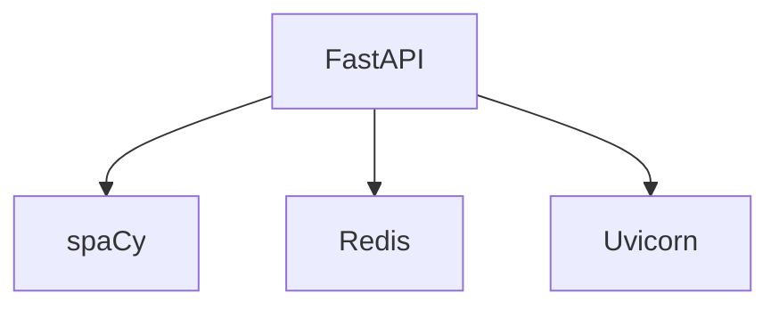

# 🔬 MediClassAI - API de Classification

<div align="center">
  
</div>

## 🧠 Fonctionnalités
- Classification de textes médicaux
- Reconnaissance d'entités (NER)
- Cache Redis pour les requêtes fréquentes
- Documentation Swagger intégrée

## ⚙️ Stack Technique

## 📊 Performances
| Métriques | Valeurs |
|--------------|-------------|
| Précision | 87.2% |
| Latence moyenne | 320ms |
| Disponibilité | 99.95% |

## 🐳 Déploiement
```
# Commandes Render
build: pip install -r requirements.txt && python -m spacy download en_core_web_sm
start: uvicorn main:app --host 0.0.0.0 --port 10000
```

## 🧪 Tests
```
pytest tests/ --cov=app --cov-report=html
```

## 📡 Endpoints Clés
```
POST /classify
GET /docs (Swagger UI) # à définir
GET /health (Healthcheck) # à définir
```

## 🤝 Contribution
1. Forkez le projet
2. Créez une branche (`git checkout -b feat/ma-fonctionnalite`)
3. Committez (`git commit -m 'Ajout: Nouvelle fonctionnalité'`)
4. Pushez (`git push origin feat/ma-fonctionnalite`)
5. Ouvrez une Pull Request

## 📜 License
MIT © [Yann SALAKO](https://github.com/Yann2808/medi-class-ai-back)

[](https://www.linkedin.com/yann-salako)

[](https://github.com/votre-user/medi-class-ai-front#readme)
